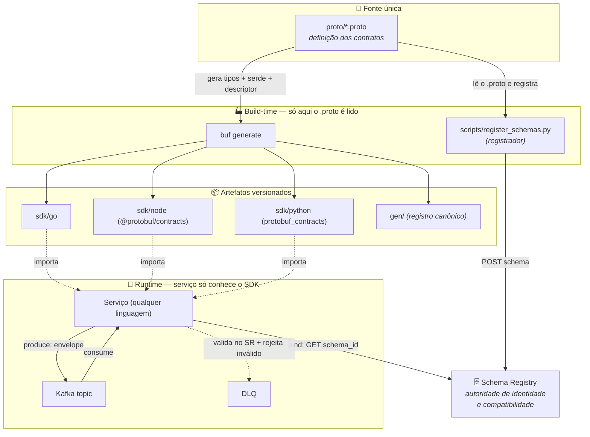
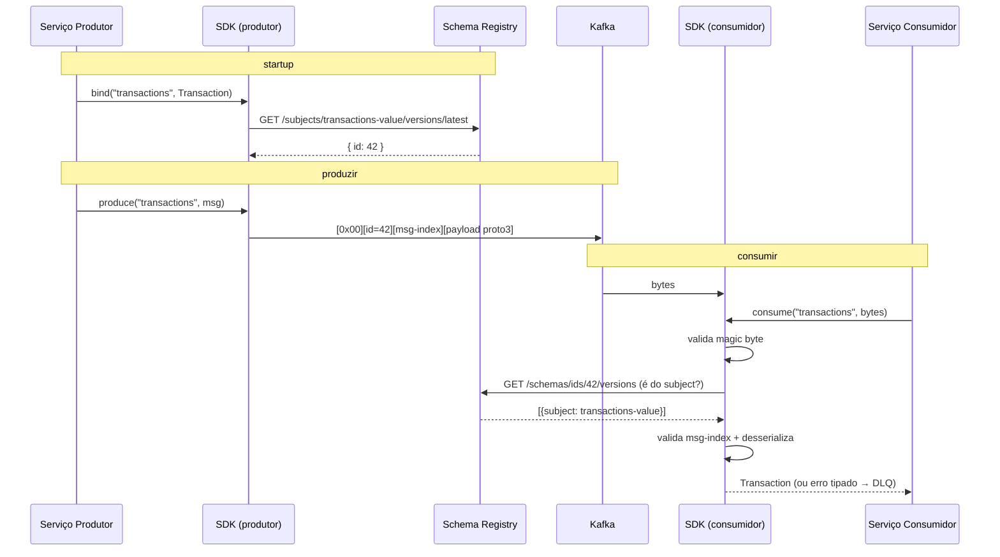
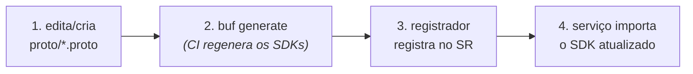

# protobuf-contracts

[](https://github.com/vinirmbrozz/protobuf-contracts/actions/workflows/buf-ci.yml)

> Repositório central de **contratos de dados**. O `.proto` é a **fonte única**: a partir dele
> geramos uma **biblioteca (SDK) por linguagem** (Go, Node, Python). Qualquer serviço **importa o
> SDK** para produzir/consumir mensagens no Kafka — e o **Schema Registry** garante que só trafegue
> o que está no formato combinado. **Ninguém toca no `.proto` em runtime; ninguém monta o envelope na
> mão; ninguém registra schema na mão.** Adicionar um contrato novo é só criar um `.proto` e rodar a
> geração — todos os SDKs se atualizam sozinhos.

---

## Dois conceitos que aparecem já no diagrama

- **serde** (serializer + deserializer): a camada que **transforma a mensagem (objeto) em bytes**
  para enviar ao Kafka e os **bytes de volta em objeto** ao receber. Aqui o serde também **embrulha/
  desembrulha o envelope Confluent** (magic byte + `schema_id` + índice + payload) e valida no consumo.
  É o que cada SDK entrega pronto — o serviço só chama `produce`/`consume`.

- **descriptor**: a **descrição da estrutura** da mensagem (campos, tipos, ordem de declaração) que o
  `protoc`/`buf` **embute no código gerado**. É a partir dele que o SDK sabe, de forma genérica, qual o
  índice de cada mensagem e como (de)serializar — **sem precisar ler o `.proto` em runtime**. (No Node,
  como o gerador não embute o descriptor, embutimos um `FileDescriptorSet` para ter a mesma informação.)

---

## A ideia em um diagrama



**Em uma frase:** o `.proto` vira SDKs (via `buf generate`) e schemas no Registry (via o registrador);
o serviço **só importa o SDK** e chama `bind` / `produce` / `consume` — o SDK cuida do envelope e o
Schema Registry é o porteiro.

---

## O problema que isso resolve

Sem um contrato central, cada serviço reimplementa a (de)serialização das mensagens do Kafka, os
formatos divergem entre linguagens, e mudanças de schema quebram consumidores silenciosamente. Aqui:

- **Uma definição só** (`proto/`) → tipos idênticos em Go, Node e Python.
- **Um envelope só** (Confluent Schema Registry) → toda mensagem carrega a identidade do seu schema.
- **Compatibilidade garantida** → o Registry recusa um schema que quebre os consumidores (regra
  **BACKWARD**).
- **Interoperabilidade real** → uma mensagem produzida em Node é consumida byte-a-byte em Go e Python.

---

## O contrato do projeto (os princípios)

1. **O `.proto` é tocado por UMA coisa só: a geração.** `buf generate` produz os SDKs; o registrador
   lê o `.proto` para registrar o schema. **Nenhum serviço, producer, consumer ou runtime lê `.proto`.**
2. **O SDK é a única interface.** Cada `sdk/<lang>` é auto-suficiente: tipos gerados + **schema/descriptor
   embutido** + serde (envelope Confluent) + integração com o Registry.
3. **O serviço importa o SDK e pronto.** `bind(topic, Tipo)` no startup, depois `produce`/`consume`.
   O serviço nunca vê schema, `.proto`, descriptor, codec, magic byte, `schema_id` ou payload cru.
4. **O Schema Registry é a autoridade.** O SDK **resolve** o `schema_id` do Registry (só lê); quem
   **registra** é o passo de build/ops (o registrador). O Registry garante identidade e compatibilidade.

---

## Como funciona (runtime)



**Envelope (wire format Confluent):**

```
[0x00 magic] [schema_id: 4 bytes big-endian] [message-index] [payload proto3]
```

- **`schema_id`** — resolvido do Registry no `bind` (produtor carimba; consumidor valida).
- **`message-index`** — qual mensagem do `.proto` é esta (tamanho variável; derivado do descriptor —
  genérico para qualquer mensagem, sem código por-contrato).
- O **payload** é proto3 puro.

---

## Segurança (o que é garantido, e onde)

O cumprimento do contrato acontece no **consumidor**. No `consume`, a mensagem é **rejeitada** (erro
tipado, para o adapter rotear à **DLQ**) se:

- o **magic byte** não for `0x00`;
- o frame for curto demais;
- o **`schema_id` não for uma versão registrada do subject daquele tópico** (id de outro schema/tópico
  ou desconhecido → rejeitado; uma versão **mais nova compatível** do mesmo subject é aceita);
- o **message-index** não bater com o tipo esperado;
- o payload não desserializar.

> ⚠️ **Honestidade sobre o alcance:** o Kafka puro aceita bytes quaisquer. Este projeto **não barra a
> escrita no broker** — barrar na entrada exigiria *broker-side schema validation* (Confluent Platform)
> ou um proxy. O envelope **não é assinado**: autenticação de remetente é outra camada (ACLs/TLS). O que
> garantimos é **integridade estrutural e de schema, aplicada no consumidor**.

---

## Layout do repositório

| Caminho | Conteúdo |
|---|---|
| `proto/` | Fontes `.proto` — **fonte única**; nunca editar gerados |
| `sdk/go/` · `sdk/node/` · `sdk/python/` | SDKs publicáveis: tipos + serde + descriptor embutido |
| `gen/` | Codegen canônico (`buf generate`); registro, nunca editar à mão |
| `scripts/register_schemas.py` · `scripts/schemas.json` | **Registrador** (único que escreve schema no SR) + mapa topic→proto |
| `interop/` | Harness cross-language: os 3 SDKs produzem e consomem entre si |
| `docs/` | Especificações e políticas aprofundadas |
| `buf.yaml` · `buf.gen.yaml` | Config do buf + pipeline de codegen |
| `.github/workflows/` | CI: lint, breaking, testes dos SDKs, interop com SR real, geração |

---

## Como um serviço consome (por linguagem)

> Nenhum exemplo lê `.proto`, passa schema, ou monta envelope. Só **importa o SDK**.
> Variáveis de ambiente: `SCHEMA_REGISTRY_URL` (obrigatória), `SCHEMA_REGISTRY_API_KEY` /
> `SCHEMA_REGISTRY_API_SECRET` (opcionais, para Registry autenticado).

### Go

```go
import (
    serde "github.com/vinirmbrozz/protobuf-contracts/sdk/go"
    txpb  "github.com/vinirmbrozz/protobuf-contracts/sdk/go/protobuf/transaction/v1"
)

s, _ := serde.New()                              // lê SCHEMA_REGISTRY_URL
_ = s.Bind("transactions", &txpb.Transaction{})  // resolve o schema_id no Registry

frame, _ := s.Produce("transactions", &txpb.Transaction{
    Transaction: &txpb.TransactionData{
        Id: "tx-1", AmountTotal: "9.99", Channel: "web", Type: "PIX",
    },
})

msg, _ := s.Consume("transactions", kafkaBytes)  // erro tipado → DLQ
tx := msg.(*txpb.Transaction)
```

### Node / TypeScript

```ts
import { ProtobufSerde, Transaction } from '@protobuf/contracts';

const serde = new ProtobufSerde();                 // lê SCHEMA_REGISTRY_URL
await serde.bind('transactions', Transaction);    // resolve o schema_id

const frame = serde.produce('transactions', Transaction.fromPartial({
  transaction: { id: 'tx-1', amountTotal: '9.99', channel: 'web', type: 'PIX' },
}));

const tx = await serde.consume('transactions', kafkaBytes); // SerdeError → DLQ
```

### Python

```python
from protobuf_contracts import Transaction, TransactionData
from protobuf_contracts.serde import KafkaSerde

serde = KafkaSerde()                              # lê SCHEMA_REGISTRY_URL
serde.bind("transactions", Transaction)           # resolve o schema_id

frame = serde.produce("transactions", Transaction(
    transaction=TransactionData(id="tx-1", amount_total="9.99", channel="web", type="PIX"),
))

tx = serde.consume("transactions", kafka_bytes)   # SerdeError → DLQ
```

---

## Como adicionar um contrato novo (o ponto do projeto)



1. Edite ou crie `proto/<dominio>.proto` (campos novos em `snake_case`; nunca remover — regra
   **BACKWARD**).
2. `buf generate` regenera **todos** os SDKs e o descriptor — **sem código por-linguagem por-contrato**
   (o CI faz isso automaticamente em `generate.yml`).
3. Adicione o tópico no `scripts/schemas.json` e rode o registrador (registra o schema no Registry).
4. O serviço atualiza a versão do SDK e usa o tipo novo. Pronto.

---

## Desenvolvimento local

```bash
# 1. Subir Kafka + Schema Registry (localhost:8081)
docker compose up -d

# 2. Registrar os schemas no Registry local
SCHEMA_REGISTRY_URL=http://localhost:8081 python scripts/register_schemas.py

# 3. Testes de cada SDK (isolados, com SR mockado)
cd sdk/go && go test ./...
cd sdk/node && npm install && npm test
pip install sdk/python/ pytest && python -m pytest sdk/python/tests/test_serde_unit.py

# 4. Interop cross-language contra o SR real (Go ↔ Node ↔ Python)
cd sdk/node && npm install && npm run build
pip install sdk/python/
cd interop && npm install
SCHEMA_REGISTRY_URL=http://localhost:8081 node interop/orchestrate.mjs
```

**Toolchain:** [`buf`](https://buf.build/docs/installation), Go 1.21+, Node 20+, Python 3.11+, Docker.
A **geração** (`buf generate`) roda no CI/Linux (`generate.yml`) — não precisa rodar no seu host.

---

## Links

- [Visão geral](docs/visao-geral.md) — para quem está chegando agora
- [SPEC serde Confluent SR](docs/confluent-sr-serde-spec.md) — contrato autoritativo do wire format
- [Política de versionamento](docs/versioning-policy.md) — BACKWARD, layout proto, `snake_case`
- [Packaging e layout dos SDKs](docs/packaging.md) — estrutura canônica `sdk/`
